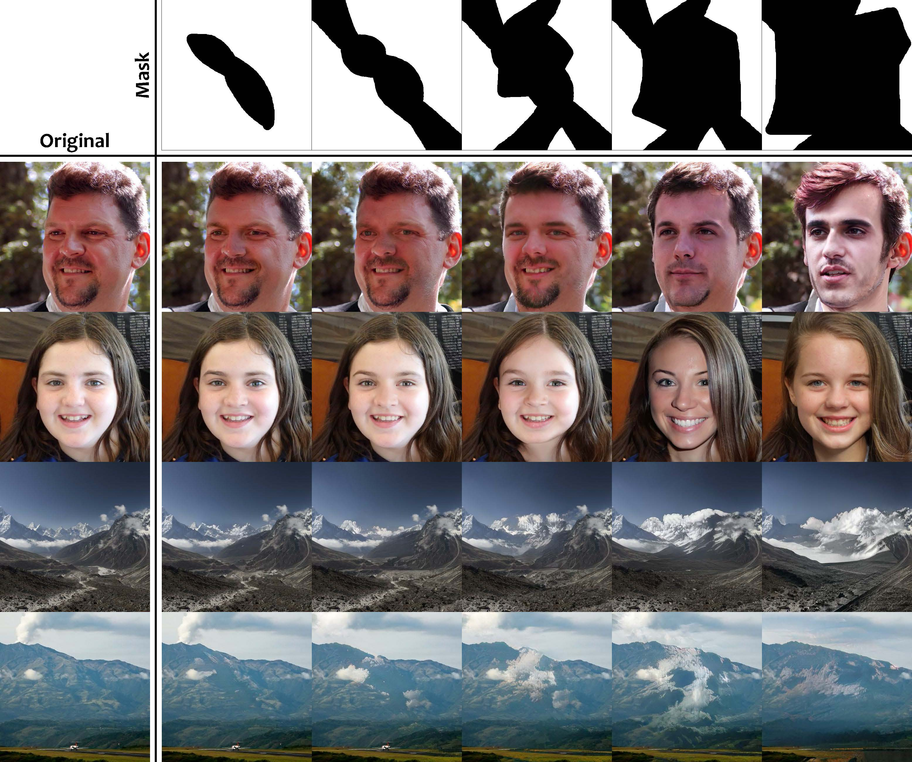

# Large Scale Image Completion via Co-Modulated Generative Adversarial Networks, ICLR 2021 (Spotlight)

### [Demo](http://comodgan.ml) | [Paper](https://openreview.net/pdf?id=sSjqmfsk95O)


**[NOTICE]** Our web demo will be closed recently. Enjoy the last days!

**[NEW!]** Time to play with our [interactive web demo](http://comodgan.ml)!

*Numerous task-specific variants of conditional generative adversarial networks have been developed for image completion. Yet, a serious limitation remains that all existing algorithms tend to fail when handling **large-scale missing regions**. To overcome this challenge, we propose a generic new approach that bridges the gap between image-conditional and recent modulated unconditional generative architectures via **co-modulation** of both conditional and stochastic style representations. Also, due to the lack of good quantitative metrics for image completion, we propose the new **Paired/Unpaired Inception Discriminative Score (P-IDS/U-IDS)**, which robustly measures the perceptual fidelity of inpainted images compared to real images via linear separability in a feature space. Experiments demonstrate superior performance in terms of both quality and diversity over state-of-the-art methods in free-form image completion and easy generalization to image-to-image translation.*



Large Scale Image Completion via Co-Modulated Generative Adversarial Networks<br>
[Shengyu Zhao](https://scholar.google.com/citations?user=gLCdw70AAAAJ), [Jonathan Cui](https://www.linkedin.com/in/jonathan-cui-110b211a6/), Yilun Sheng, Yue Dong, Xiao Liang, Eric I Chang, Yan Xu<br>
Tsinghua University and Microsoft Research<br>
[arXiv](http://arxiv.org/abs/2103.10428) | [OpenReview](https://openreview.net/pdf?id=sSjqmfsk95O)

## Overview

This repo is implemented upon and has the same dependencies as the official [StyleGAN2 repo](https://github.com/NVlabs/stylegan2). We also provide a [Dockerfile](https://github.com/zsyzzsoft/co-mod-gan/blob/master/Dockerfile) for Docker users. This repo currently supports:
- [x] Large scale image completion experiments on FFHQ and Places2
- [x] Image-to-image translation experiments on Edges2Shoes and Edges2Handbags
- [ ] Image-to-image translation experiments on COCO-Stuff
- [x] Evaluation code of *Paired/Unpaired Inception Discriminative Score (P-IDS/U-IDS)*

## Datasets

- FFHQ dataset (in TFRecords format) can be downloaded following the [StyleGAN2 repo](https://github.com/NVlabs/stylegan2).
- Places2 dataset can be downloaded in [this website](http://places2.csail.mit.edu/download.html) (Places365-Challenge 2016 high-resolution images, [training set](http://data.csail.mit.edu/places/places365/train_large_places365challenge.tar) and [validation set](http://data.csail.mit.edu/places/places365/val_large.tar)). The raw images should be converted into TFRecords using `dataset_tools/create_from_images.py` with `--shuffle --compressed`.
- Edges2Shoes and Edges2Handbags datasets can be downloaded following the [pix2pix repo](https://github.com/phillipi/pix2pix). The raw images should be converted into TFRecords using `dataset_tools/create_from_images.py` with `--shuffle --pix2pix`.
- To prepare a custom dataset, please use `dataset_tools/create_from_images.py`, which will automatically center crop and resize your images to the specified resolution. You only need to specify `--val-image-dir` for testing purpose.

## Training

The following script is for training on FFHQ. It will split 10k images for validation. We recommend using 8 NVIDIA Tesla V100 GPUs for training. Training at 512x512 resolution takes about 1 week.

```bash
python run_training.py --data-dir=DATA_DIR --dataset=DATASET --metrics=ids10k --mirror-augment --num-gpus=8
```

The following script is for training on Places2 at resolution 512x512 (resolution must be specified when training on compressed dataset), which has a validation set of 36500 images:

```bash
python run_training.py --data-dir=DATA_DIR --dataset=DATASET --resolution=512 --metrics=ids36k5 --total-kimg 50000 --num-gpus=8
```

The following script is for training on Edges2Handbags (and similarly for Edges2Shoes):

```bash
python run_training.py --data-dir=DATA_DIR --dataset=DATASET --metrics=fid200-rt-handbags --mirror-augment --num-gpus=8
```

## Pre-Trained Models

Our pre-trained models are available on [Google Drive](https://drive.google.com/drive/folders/1zSJj1ichgSA-4sECGm-fQ0Ww8aiwpkoO):

| Model name & URL                                             | Description                                                  |
| ------------------------------------------------------------ | ------------------------------------------------------------ |
| [co-mod-gan-ffhq-9-025000.pkl](https://drive.google.com/file/d/1b3XxfAmJ9k2vd73j-3nPMr_lvNMQOFGE/view?usp=sharing) | Large scale image completion on FFHQ (512x512)               |
| [co-mod-gan-ffhq-10-025000.pkl](https://drive.google.com/file/d/1M2dSxlJnCFNM6LblpB2nQCnaimgwaaKu/view?usp=sharing) | Large scale image completion on FFHQ (1024x1024)             |
| [co-mod-gan-places2-050000.pkl](https://drive.google.com/file/d/1dJa3DRWIkx6Ebr8Sc0v1FdvWf6wkd010/view?usp=sharing) | Large scale image completion on Places2 (512x512)            |
| [co-mod-gan-coco-stuff-025000.pkl](https://drive.google.com/file/d/1Ol9_pKMpfIHHwbdE7RFmJcCAzfj8hqxQ/view?usp=sharing) | Image-to-image translation on COCO-Stuff (labels to photos) (512x512) |
| [co-mod-gan-edges2shoes-025000.pkl](https://drive.google.com/file/d/155p-_zAtL8RJSsKHAWrRaGxJVzT4NZKg/view?usp=sharing) | Image-to-image translation on edges2shoes (256x256)          |
| [co-mod-gan-edges2handbags-025000.pkl](https://drive.google.com/file/d/1nBIQaUs6fXRpEt1cweqQKtWVw5UZAqLi/view?usp=sharing) | Image-to-image translation on edges2handbags (256x256)       |

Use the following script to run the interactive demo locally:

```bash
python run_demo.py -d DATA_DIR/DATASET -c CHECKPOINT_FILE(S)
```

or the following command as a minimal example of usage:

```bash
python run_generator.py -c CHECKPOINT_FILE -i imgs/example_image.jpg -m imgs/example_mask.jpg -o imgs/example_output.jpg
```

## Evaluation

The following script is for evaluation:

```bash
python run_metrics.py --data-dir=DATA_DIR --dataset=DATASET --network=CHECKPOINT_FILE(S) --metrics=METRIC(S) --num-gpus=1
```

Commonly used metrics are `ids10k` and `ids36k5` (for FFHQ and Places2 respectively), which will compute P-IDS and U-IDS together with FID. By default, masks are generated randomly for evaluation, or you may append the metric name with `-h0` ([0.0, 0.2]) to `-h4` ([0.8, 1.0]) to specify the range of masked ratio.

## Citation

If you find this code helpful, please cite our paper:
```
@inproceedings{zhao2021comodgan,
  title={Large Scale Image Completion via Co-Modulated Generative Adversarial Networks},
  author={Zhao, Shengyu and Cui, Jonathan and Sheng, Yilun and Dong, Yue and Liang, Xiao and Chang, Eric I and Xu, Yan},
  booktitle={International Conference on Learning Representations (ICLR)},
  year={2021}
}
```